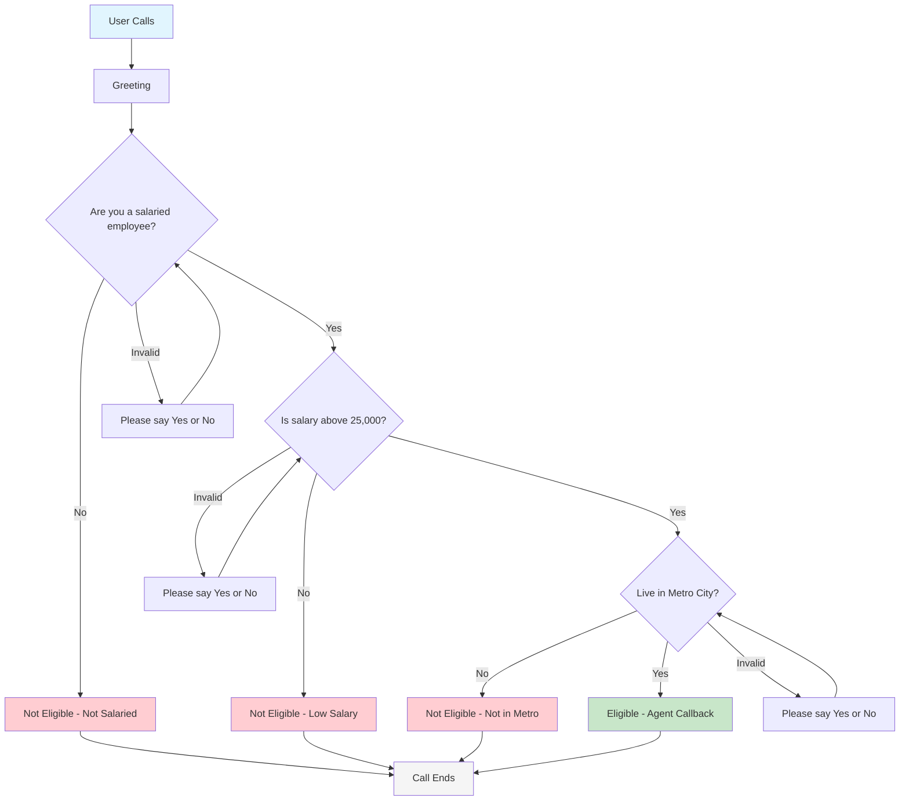
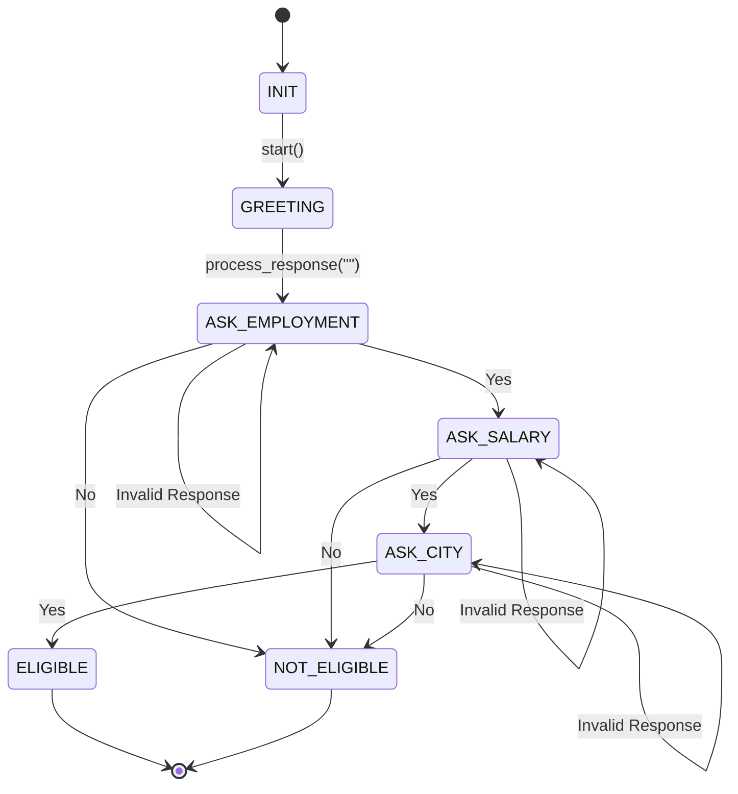
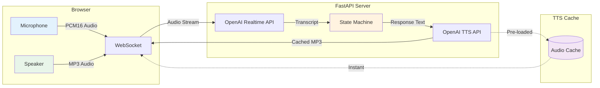
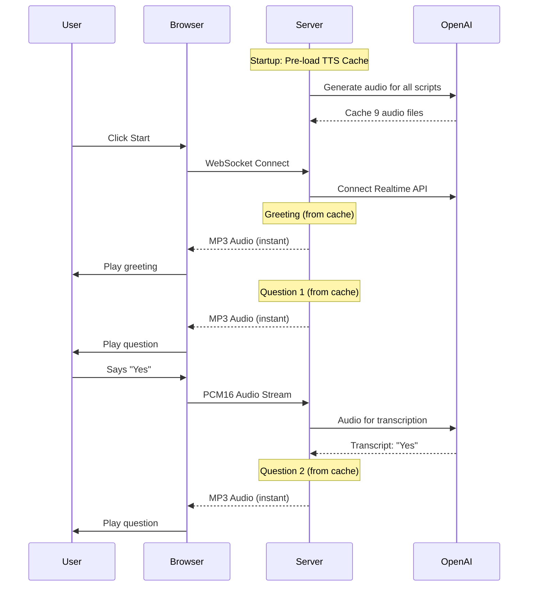

# QuickRupee Voice Bot

An AI-powered voice bot that screens loan applicants through automated conversations. Built for interview demonstration - runs entirely on your laptop with just an OpenAI API key.

---

## Quick Start (3 Steps)

### 1. Install Dependencies

```bash
cd quickrupee-voicebot
python -m venv venv
source venv/bin/activate  # Windows: venv\Scripts\activate
pip install -r requirements.txt
```

### 2. Configure API Key

```bash
cp .env.example .env
# Edit .env and add: OPENAI_API_KEY=sk-proj-your-key-here
```

### 3. Run the Demo

```bash
python demo_server.py
```

Open `http://localhost:8000` in Chrome or Edge browser.

---

## Conversation Flow Diagram



---

## State Machine Diagram



---

## System Architecture



---

## What It Does

Screens loan applicants with 3 questions:

1. **"Are you a salaried employee?"**
2. **"Is your monthly salary above 25,000?"**
3. **"Do you live in Delhi, Mumbai, or Bangalore?"**

| Response | Result |
|----------|--------|
| All Yes | Eligible (agent will call back) |
| Any No | Not eligible (call ends politely) |
| Invalid | Re-asks with clarification |

---

## Key Features

| Feature | Description |
|---------|-------------|
| **Hybrid Speech Processing** | Realtime API for STT, Standard TTS API for speech |
| **TTS Caching** | Pre-loads all responses at startup for instant playback |
| **Input Validation** | Re-asks if user doesn't say Yes/No |
| **Mic Muting** | Prevents bot from hearing itself |
| **Rule-based Logic** | Deterministic, auditable eligibility decisions |

---

## Project Structure

```
quickrupee-voicebot/
├── demo_server.py          <- Main server (run this!)
├── state_machine.py        <- Eligibility logic & scripts
├── openai_realtime.py      <- Speech-to-text integration
├── config.py               <- Configuration settings
├── static/demo.html        <- Browser interface
├── test_state_machine.py   <- Unit tests
└── requirements.txt        <- Dependencies
```

---

## Tech Stack

| Component | Technology | Purpose |
|-----------|-----------|---------|
| Backend | FastAPI | High-performance async web framework |
| STT | OpenAI Realtime API | Real-time speech transcription with VAD |
| TTS | OpenAI TTS API | Text-to-speech with caching |
| Logic | Python State Machine | Deterministic eligibility rules |
| Frontend | HTML5 + Web Audio API | Browser-based demo interface |
| Transport | WebSocket | Bidirectional streaming |

---

## Audio Flow



---

## Testing

```bash
# Test business logic
python test_state_machine.py

# Test demo scenarios
# 1. Open http://localhost:8000
# 2. Click "Start Conversation"
# 3. Answer "Yes" to all -> Should be eligible
# 4. Try "Yes", "No" -> Should reject early
```

---
